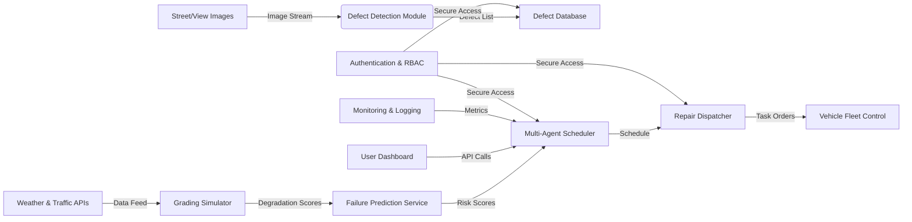
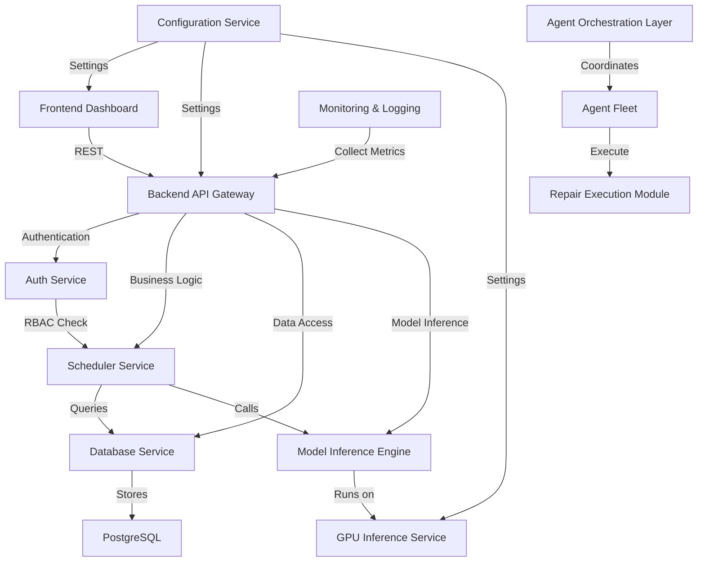
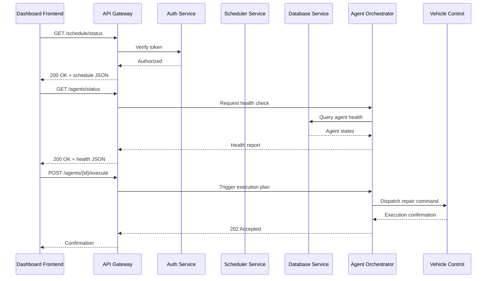
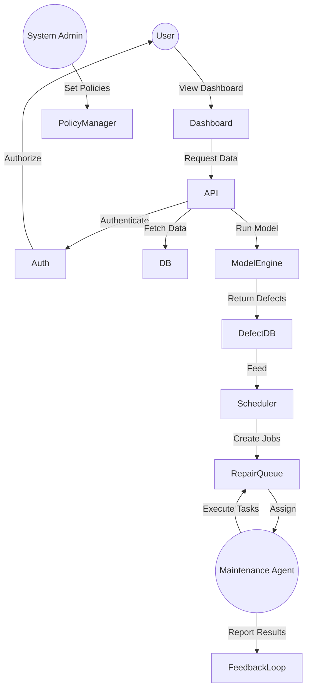

# Software Design Document (SDD) - Autonomous Road Infrastructure Maintenance System (ARIMS)

**Version:** 1.0  
**Author:** Architect & Engineering Team  
**Date:** 2026-08-07  

---

## 1. Functional Requirements
| ID | Requirement | Description |
|----|-----------|-------------|
| FR-01 | Road Defect Detection | Identify and classify road defects (cracks, potholes, surface failures) from street‑view images or satellite tiles. |
| FR-02 | Defect Verification | Validate detection results using secondary imaging modalities and expert review pipelines. |
| FR-03 | Degradation Prediction | Predict future condition of road segments using historical defect data, traffic patterns, weather, and material properties. |
| FR-04 | Multi‑Agent Scheduling | Coordinate a fleet of autonomous maintenance agents to prioritize, schedule, and dispatch repair tasks. |
| FR-05 | Dashboard Visualization | Provide interactive dashboards displaying road health maps, repair schedules, cost estimates, and agent reasoning. |
| FR-06 | API Management | Expose RESTful APIs for data ingestion, model inference, agent control, and dashboard retrieval. |
| FR-07 | System Monitoring | Continuously monitor system health, resource utilization, and agent performance. |
| FR-08 | Automated Deployment | Support containerized deployment and CI/CD pipelines for reproducible environments. |
| FR-09 | Documentation Generation | Produce research‑quality documentation and publication‑ready figures. |

---

## 2. Non‑Functional Requirements
| ID | Requirement | Target |
|----|-----------|--------|
| NFR‑01 | Performance | Detection latency ≤ 30 ms per image; prediction latency ≤ 100 ms per segment. |
| NFR‑02 | Scalability | System must support ≥ 10,000 km of road network with concurrent agents. |
| NFR‑03 | Accuracy | mAP ≥ 0.78 for defect detection; prediction RMSE ≤ 5 % of actual degradation. |
| NFR‑04 | Reliability | 99.5 % uptime for critical services; graceful degradation on partial failures. |
| NFR‑05 | Security | Role‑Based Access Control (RBAC); all API endpoints TLS‑encrypted; audit logging. |
| NFR‑06 | Maintainability | Modular codebase; ≥ 80 % code coverage by unit tests; documented API contracts. |
| NFR‑07 | Portability | Containerized (Docker) with support for Linux and Windows hosts. |
| NFR‑08 | Usability | Dashboard UI must be responsive on desktop and tablet; intuitive navigation. |
| NFR‑09 | Extensibility | Plug‑in architecture for new defect types or agent behaviours without core rewrites. |

---

## 3. System Architecture Diagram (Mermaid)



---

## 4. Component Diagram (Mermaid)



---

## 5. Data Flow Diagram (DFD) – Level 0

```
+-------------------+
|   External System |
+-------------------+
          ↓
+-------------------+          +-------------------+
|  Image Acquisition|──────►   | Defect Detection  |
+-------------------+          +-------------------+
          ↓                           ↓
+-------------------+          +-------------------+
|  Weather/Traffic  |──────►   |   Degradation     |
|  Data Ingestion   |          |   Prediction      |
+-------------------+          +-------------------+
          ↓                           ↓
+-------------------+          +-------------------+
|  Multi‑Agent      |◄───────   |   Agent Scheduler |
|  Orchestration    |          +-------------------+
+-------------------+
          ↓
+-------------------+
|   Dashboard UI    |
+-------------------+
          ↓
+-------------------+
|   REST API Layer  |
+-------------------+
```

---

## 6. Sequence Diagram – Agent Scheduling Flow (Mermaid)



---

## 7. Use Case Diagram (Mermaid)



---

## 8. Database Schema (High‑Level ER Diagram – Mermaid)

```mermaid
erDiagram
    ROAD ||--o{ SEGMENT : contains
    SEGMENT ||--o{ DEFECT : has
    DEFECT {
        uuid id PK
        varchar type
        float severity
        timestamp detected_at
        geometry location
    }
    ROAD ||--o{ WEATHER_DATA : influenced_by
    WEATHER_DATA {
        timestamp
        varchar condition
        float precipitation
    }
    ROAD ||--o{ TRAFFIC_DATA : affected_by
    TRAFFIC_DATA {
        timestamp
        integer vehicle_count
    }
    AGENT ||--o{ SCHEDULE : executes
    SCHEDULE {
        uuid id PK
        uuid segment_id FK
        varchar priority
        timestamp planned_at
        varchar status
    }
    USER ||--o{ DASHBOARD : views
    DASHBOARD {
        uuid id PK
        varchar view_type
        timestamp last_access
    }
    AUTH {
        uuid user_id PK
        varchar role
        varchar email
    }
```

---

## 9. Technology Stack & Justification
| Layer | Technology | Reasoning |
|-------|------------|-----------|
| **Programming Language** | Python 3.11 | Rich ecosystem for AI/ML, mature scientific libraries, excellent GPU support. |
| **ML Framework** | PyTorch 2.4 | Dynamic graph, strong community, native support for transformer models and custom agents. |
| **Detection Model** | YOLOv11 / RT‑DETR / Vision Transformer | Enables comparative experimentation; each offers different trade‑offs in speed/accuracy. |
| **Data Storage** | PostgreSQL + PostGIS | Spatial queries, robust GIS support, ACID compliance, seamless integration with mapping dashboards. |
| **Model Serving** | TorchServe + Docker | Scalable inference, built‑in monitoring, easy containerization. |
| **Agent Orchestration** | Multi‑Agent System (MAS) framework built on **Ray** | Distributed execution, fault tolerance, dynamic agent creation, and easy scaling. |
| **Frontend** | React + Ant Design + Deck.gl | Component richness, responsive design, high‑performance geospatial visualizations. |
| **Backend API** | FastAPI (Python) | Automatic OpenAPI generation, async support, high performance, validation via Pydantic. |
| **Containerization** | Docker + Docker‑Compose | Reproducible environments, isolated services, facilitates CI/CD. |
| **CI/CD** | GitHub Actions | Automated testing, linting, container build, deployment to Kubernetes or cloud VMs. |
| **Monitoring** | Prometheus + Grafana | Industry‑standard metrics collection, alerting, dashboards for operational visibility. |
| **Authentication** | OAuth2 + JWT | Secure token‑based authentication, role‑based access, easy integration with third‑party identity providers. |
| **Logging** | Structured JSON logging via `loguru` | Easy parsing, correlation across services, support for log aggregation. |
| **Exception Handling** | Centralized middleware (FastAPI) | Consistent error responses, detailed stack traces for debugging. |
| **API Documentation** | Swagger/OpenAPI auto‑generated | Self‑documenting endpoints, interactive UI for external stakeholders. |

---

## 10. Folder Structure (Proposed)
```
road-ai-project/
├── .github/
│   └── workflows/
│       └── ci.yml                 # GitHub Actions pipeline
├── agents/
│   ├── detection/
│   │   └── detector.py
│   ├── degradation/
│   │   └── predictor.py
│   ├── scheduling/
│   │   └── scheduler.py
│   └── utils/
│       └── config.py
├── models/
│   ├── yolov11/
│   ├── rtdetr/
│   └── transformer_det/
├── training/
│   ├── dataset.py
│   ├── train.py
│   └── checkpoints/
├── evaluation/
│   ├── metrics.py
│   └── reports/
├── utils/
│   ├── augmentations.py
│   └── geo_utils.py
├── scripts/
│   ├── data_download.sh
│   ├── retrain_models.sh
│   └── deploy.sh
├── notebooks/
│   └── exploration.ipynb
├── docker/
│   ├── Dockerfile
│   └── docker-compose.yml
├── monitoring/
│   └── prometheus.yml
├── src/
│   ├── api/
│   │   ├── routes/
│   │   └── schemas/
│   ├── core/
│   │   ├── scheduler.py
│   │   └── agent_orchestrator.py
│   ├── models/
│   │   └── inference.py
│   └── services/
│       ├── auth.py
│       ├── db.py
│       └── logging.py
├── tests/
│   ├── unit/
│   └── integration/
├── docs/
│   └── research_papers/
├── PROJECT_JOURNAL.md
└── SDD.md                            # ← This file
```

---

## 11. API Design (Sample Endpoints – OpenAPI Snippet)

```yaml
openapi: 3.0.3
info:
  title: ARIMS API
  version: 1.0.0
paths:
  /detect:
    post:
      summary: Run defect detection on an image
      requestBody:
        required: true
        content:
          image/jpeg:
            schema:
              type: string
              format: binary
      responses:
        '200':
          description: Detection results
          content:
            application/json:
              schema:
                $ref: '#/components/schemas/DetectionResponse'
  /schedule:
    get:
      summary: Retrieve current repair schedule
      security:
        - bearerAuth: []
      responses:
        '200':
          description: Schedule JSON
    post:
      summary: Submit a new repair job
      requestBody:
        required: true
        content:
          application/json:
            schema:
              $ref: '#/components/schemas/ScheduleRequest'
      responses:
        '202':
          description: Accepted – job queued
components:
  securitySchemes:
    bearerAuth:
      type: http
      scheme: bearer
      bearerFormat: JWT
```

---

## 12. AI Agent Interaction Flow
1. **Detection Agent** consumes raw imagery → outputs defect candidates (bounding boxes + class).  
2. **Validation Agent** consumes detection output → cross‑checks with auxiliary sensors (LiDAR, thermal) → refines results.  
3. **Degradation Agent** ingests validated defects + external data → predicts failure probability per segment.  
4. **Priority Agent** evaluates risk, cost, and strategic importance → generates prioritized job list.  
5. **Scheduler Agent** orchestrates available repair agents → assigns tasks respecting resource constraints.  
6. **Execution Agent** receives task → issues command to repair vehicle or autonomous crew.  
7. **Monitoring Agent** watches execution status → reports back to Scheduler for replanning if needed.  
8. **Reporting Agent** compiles performance metrics → updates Dashboard and archival logs.  

*Communication* uses an event‑bus (Kafka‑compatible) with topic‑based routing, ensuring asynchronous, fault‑tolerant exchanges.

---

## 13. Dataset Workflow
| Stage | Action | Tools/Artifacts |
|-------|--------|-----------------|
| **Collection** | Pull raw street‑view images, LiDAR point clouds, telemetry logs | `scripts/data_download.sh`; external APIs (Mapillary, OpenStreetCam) |
| **Analysis** | Visual inspection, class balance audit, quality scoring | Pandas, OpenCV, custom QA notebooks |
| **Cleaning** | Remove duplicates, filter low‑resolution frames, geo‑tag validation | `utils/geo_utils.py` |
| **Annotation Verification** | Cross‑validate with domain experts, resolve conflicts | Web‑based labeling UI (Label Studio) |
| **Augmentation** | Geometric transforms, illumination variations, synthetic defect injection | Albumentations, custom pipeline |
| **Train/Val/Test Split** | Stratified split preserving defect types, geographic distribution | `training/dataset.py` → `train_test_split` |

All raw and processed data stored under `/datasets/` with versioned metadata (JSON manifest).

---

## 14. Model Training Workflow
1. **Data Loader** → loads images + annotations from `/datasets/`.  
2. **Pre‑processing** → applies augmentations, normalizes tensors.  
3. **Model Instantiation** → selects architecture (YOLOv11, RT‑DETR, ViT‑Detector).  
4. **Loss Calculation** → detection loss (CIoU + classification).  
5. **Optimization** → AdamW optimizer with cosine annealing schedule.  
6. **Training Loop** → per‑epoch validation (mAP), checkpointing.  
7. **Evaluation** → compute metrics (mAP, Precision, Recall, F1, IoU, FPS, Latency).  
8. **Model Selection** → choose best based on composite score (accuracy weighted by latency).  
9. **Export** → TorchScript or ONNX for inference service.  

All training scripts located under `/training/` and orchestrated via `scripts/retrain_models.sh`.

---

## 15. Deployment Architecture
```
┌───────────────────────┐
│   CI/CD (GitHub Actions)  │
└───────┬───────┬───────┘
        │       │
        ▼       ▼
[Build Images]  [Run Tests]
        │       │
        └───────┘
                │
                ▼
          ┌─────────────────────┐
          │ Docker Registry (ECR) │
          └───────┬───────┬─────┘
                  │       │
                  ▼       ▼
            ┌─────────────┐   ┌─────────────┐
            │  Service 1 │   │ Service 2 │
            │ (API GW)   │   │ (Model svc)│
            └─────┬───────┘   └─────┬───────┘
                  │                 │
                  ▼                 ▼
          ┌─────────────────────────────────────┐
          │   Kubernetes Cluster (EKS / K8s)   │
          └───────┬───────────────────────┬─────┘
                  │                       │
                  ▼                       ▼
            ┌─────────────┐        ┌─────────────┐
            │  DB (Postgres)│      │  GPU Nodes │
            └─────────────┘        └─────────────┘
                  │
                  ▼
            ┌─────────────┐
            │  Prometheus │
            │  + Grafana  │
            └─────────────┘
```

*Key Points*:  
- **Stateless APIs** behind a load balancer.  
- **Model inference** hosted on GPU nodes via TorchServe.  
- **Agent orchestrator** runs as a Kubernetes Deployment with autoscale.  
- **CI/CD** ensures zero‑downtime rollouts and automated rollback.

---

## 16. Risk Analysis
| Risk | Likelihood | Impact | Mitigation |
|------|------------|--------|------------|
| **Model Accuracy < Target** | Medium | High | Early comparative experimentation; fallback to ensemble; augment dataset. |
| **Agent Coordination Deadlock** | Low | High | Implement timeout & fallback planner; use priority queue. |
| **Data Quality Issues** | Medium | Medium | Rigorous annotation verification; continuous QA scripts. |
| **Deployment Failure** | Low | High | Canary releases; automated health checks; rollback pipeline. |
| **Scalability Bottleneck** | Medium | Medium | Horizontal pod autoscaling; load testing before release. |
| **Security Breach** | Low | Critical | RBAC, JWT auth, TLS encryption, audit logging, penetration testing. |
| **Regulatory Non‑Compliance** | Low | Medium | Anonymize geographic data; comply with local data residency rules. |

---

## 17. Future Scope
- **Multi‑Modal Fusion**: Integrate SAR satellite imagery, drone footage, and IoT sensor streams.  
- **Reinforcement Learning Scheduler**: Learn optimal policies through simulated environments.  
- **Edge Deployment**: Deploy lightweight inference on onboard vehicle hardware.  
- **Explainable AI**: Generate human‑readable rationales for agent decisions.  
- **Economic Optimization**: Incorporate cost‑benefit analysis with dynamic pricing models.  
- **Domain Adaptation**: Transfer learned models to new municipalities with minimal re‑training.  
- **Public Dashboard**: Open data portal for citizen transparency and community feedback.  

---

## 18. Approval Request
This SDD is now **complete** and ready for your review.

**Please indicate:**  
- ✅ **Approve** to proceed to Milestone 1 (Requirement Analysis).  
- 🔧 **Request changes** – specify which sections need modification.  

Your approval will allow us to move forward with the detailed literature review and experimental setup.  

---  

*Prepared by the ARIMS Architectural Team*